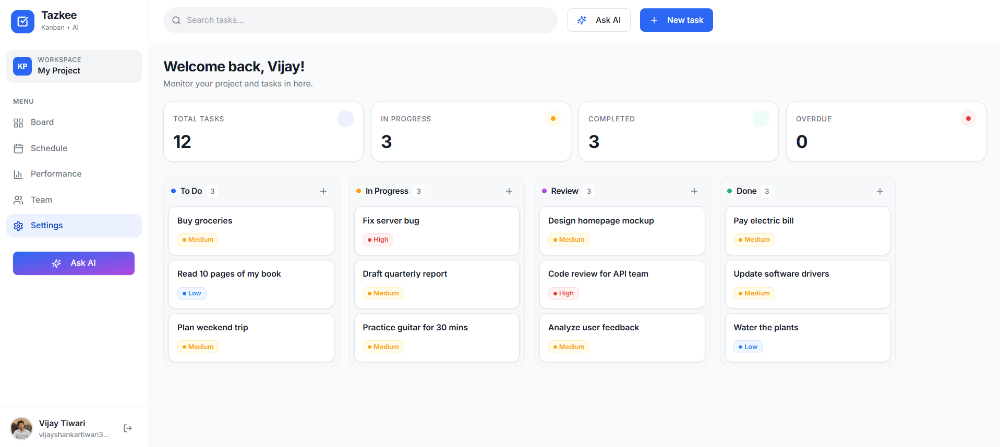
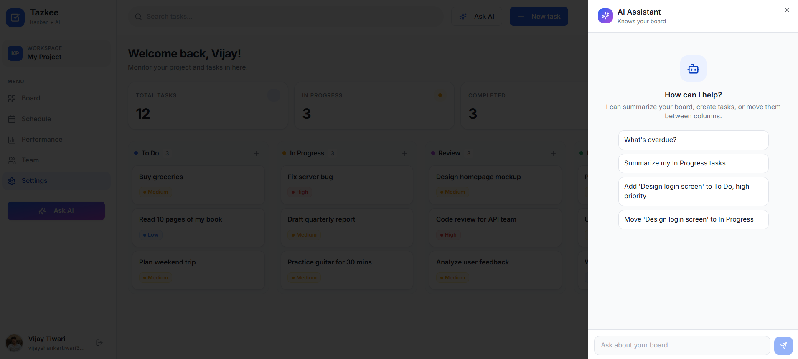
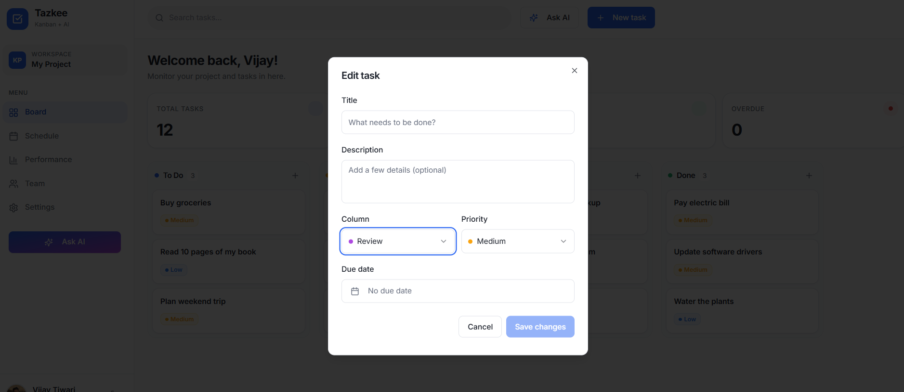

# Creative Flow Board.

A modern web application built with React, Vite, TypeScript, Tailwind CSS, and shadcn/ui components.

## Tech Stack

- **Framework:** React 18
- **Build Tool:** Vite
- **Language:** TypeScript
- **Styling:** Tailwind CSS
- **Components:** Radix UI / shadcn/ui
- **State/Data:** React Query (@tanstack/react-query)
- **Drag & Drop:** dnd-kit.

## Getting Started

### Prerequisites

Make sure you have Node.js installed on your machine.

### Installation

1. Clone the repository.
2. Install dependencies:
   ```sh
   npm install
   ```
3. Start the development server:
   ```sh
   npm run dev
   ```

## Screenshots

Here are some screenshots of the application:

### Screenshot 1


### Screenshot 2


### Screenshot 3


### Screenshot 4

